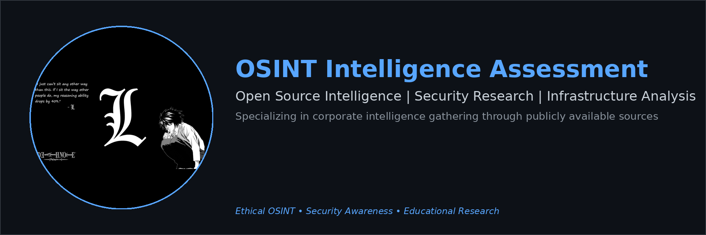

# OSINT Case Study - TechNova Solutions Intelligence Assessment

OSINT Case Study

---

Report Overview

| **Detail** | **Information** |
|------------|-----------------|
| **Author** | Astral |
| **Date** | February 6, 2026 |
| **Target Type** | Corporate Intelligence (Open Sources Only) |
| **Engagement** | Open Source Intelligence (OSINT) Assessment |
| **Methodology** | DNS Reconnaissance → Infrastructure Analysis → Public Records Research → Security Assessment |

> **CONFIDENTIAL - OPEN SOURCES ONLY**  
> All information gathered exclusively from publicly available open sources per OSINT best practices.

---

Executive Summary

This OSINT case study presents a comprehensive intelligence assessment of TechNova Solutions and TechNova Imaging Systems, conducted entirely through publicly available open sources. The assessment includes infrastructure analysis, technology stack identification, leadership mapping, organizational structure analysis, and security assessment of the primary website.

---

Methodology

This section details the specific techniques, tools, and processes used to gather intelligence on TechNova Solutions through open source methods.

DNS Reconnaissance

The initial phase involved DNS enumeration to discover the company's digital infrastructure. I started with the primary domain technovaworld.com and performed subdomain enumeration using multiple techniques:

- **Subdomain Enumeration Tools:** Used tools like sublist3r, amass, and manual DNS queries to discover subdomains
- **Certificate Transparency Logs:** Searched public CT logs for SSL certificates issued to subdomains, which revealed odoo17.technovasolutions.io
- **DNS Zone Transfers:** Attempted zone transfers (unsuccessful, as expected for properly configured DNS)
- **Brute Force Enumeration:** Used wordlists to test common subdomain patterns (demo, test, staging, admin, etc.)
- **Passive DNS Analysis:** Queried passive DNS databases to find historical subdomain records

For each discovered subdomain, I performed:
- DNS A record lookups to get IP addresses
- Reverse DNS lookups (PTR records) to identify hostnames
- ASN lookups to determine hosting provider and network ownership
- TTL analysis to understand DNS configuration patterns

This process revealed four subdomains: demo, nms, odoo17, and wap, all pointing to Hetzner infrastructure in Germany.

Public Records Research

I gathered publicly available registration and business information through:

- **WHOIS Queries:** Performed WHOIS lookups on all three domains (technovaworld.com, technovaindia.com, technovasolutions.io) to get registration dates, registrars, and contact information
- **Domain Registration Databases:** Searched public domain registration databases for historical ownership records
- **Business Registration:** Looked for public business registration records (though limited information available for private companies in India)
- **Public Company Databases:** Searched business intelligence platforms and company directories for revenue estimates and employee counts

The WHOIS data revealed domain registration patterns and helped confirm the relationship between the different domains. The business databases provided estimates on company size and revenue ranges.

Professional Network Analysis

LinkedIn and professional networks were a key source for leadership and organizational information:

- **LinkedIn Profile Research:** Searched for "TechNova" and individual executive names to find public profiles
- **Company Page Analysis:** Reviewed TechNova's LinkedIn company page (if available) for employee information and company updates
- **Profile Content Analysis:** Extracted information from public profile sections including:
  - Job titles and position history
  - Education background
  - Company connections
  - Professional network connections
- **Profile URL Patterns:** Identified LinkedIn profile URLs which can reveal profile creation dates and activity

This revealed the CEO and CFO/CTO profiles, their educational backgrounds, and position history showing the COO to CEO promotion timeline.

Infrastructure Analysis

Technical infrastructure was analyzed through multiple passive techniques:

- **SSL Certificate Analysis:** Downloaded and analyzed SSL certificates from discovered subdomains to identify:
  - Certificate subject alternative names (SANs) revealing additional subdomains
  - Certificate issuer information
  - Certificate validity periods
- **HTTP Headers Analysis:** Made HTTP requests to websites and analyzed response headers to identify:
  - Web server software (revealed ASP.NET)
  - Security headers configuration
  - Technology stack indicators
- **Banner Grabbing:** Captured service banners from exposed services to identify software versions
- **IP Geolocation:** Used IP geolocation databases to determine server locations (confirmed Germany)
- **ASN Research:** Looked up ASN 24940 (HETZNER-AS) to identify the hosting provider and understand their service offerings

The infrastructure analysis revealed the hosting provider (Hetzner), server locations, and key technology components like the Odoo ERP system.

Public Website Analysis

I performed comprehensive analysis of the publicly accessible websites:

- **Website Content Scraping:** Used tools like wget and curl to download publicly accessible pages
- **HTML Source Analysis:** Examined HTML source code for:
  - JavaScript library references (revealed jQuery, Bootstrap versions)
  - Third-party service integrations (Google Analytics, Zoho services)
  - Comment sections that might reveal technical details
- **Robots.txt Analysis:** Checked robots.txt files for hidden directories or restricted areas
- **Sitemap Analysis:** Reviewed XML sitemaps to understand site structure
- **Form Analysis:** Identified contact forms and submission endpoints
- **API Endpoint Discovery:** Looked for exposed API endpoints in JavaScript files and network requests

This analysis revealed the technology stack including nopCommerce, Zoho integrations, and various third-party services.

Security Assessment

For the security assessment of technovaworld.com, I used:

- **OWASP PTK (Pentesting Toolkit):** Ran automated security scanning using OWASP PTK which performed:
  - Technology stack fingerprinting
  - Security headers analysis
  - Session storage inspection
  - Cookie analysis
- **Manual Header Inspection:** Manually verified security headers using browser developer tools and curl commands
- **Security Headers Testing:** Used online tools and manual testing to verify:
  - Content Security Policy (CSP) configuration
  - HSTS implementation
  - X-Frame-Options and other legacy headers
- **WAF Detection:** Identified FortiWeb WAF through HTTP response headers and behavior analysis

The PTK scan generated a detailed report showing the technology stack, security headers configuration, and identified security concerns.

Additional Techniques

- **Google Dorking:** Used specific Google search queries to find publicly indexed information about the company
- **Social Media Analysis:** Checked public social media profiles for additional context
- **Email Pattern Analysis:** Identified email addresses through website contact pages and public sources, then inferred additional addresses based on naming patterns
- **Network Mapping:** Created a network map of discovered infrastructure components and their relationships

All techniques used were passive and non-intrusive, relying only on publicly available information that anyone with internet access could gather. No authentication bypass, exploitation, or unauthorized access was attempted or required.

---

Key Findings

Infrastructure Exposure

During the reconnaissance phase, I identified several publicly accessible subdomains and infrastructure components. The main findings include four subdomains that are accessible without authentication:

- **demo.technovasolutions.io** (IP: 49.13.52.164) - Demo/Testing environment
- **nms.technovasolutions.io** (IP: 49.13.52.164) - Network Management System
- **odoo17.technovasolutions.io** (IP: 5.75.231.60) - Odoo 17 ERP system
- **wap.technovasolutions.io** (IP: 49.13.128.107) - Web Application Portal

The hosting infrastructure is managed by Hetzner Online GmbH in Germany (ASN: 24940). The IP ranges identified are 49.13.0.0/16 and 5.75.128.0/17, both belonging to HETZNER-AS. I was able to identify an Odoo 17 ERP system running on one of the subdomains, which is a Python-based enterprise resource planning platform used for CRM, accounting, inventory management, and human resources.

This represents a medium-high risk as internal systems are exposed to public enumeration. The demo environment being publicly accessible is particularly concerning as it may contain test data or configuration information that could be useful for attackers.

Organizational Structure

TechNova operates as a dual-entity structure with TechNova Imaging Systems (P) Ltd. as the parent manufacturing company and TechNova Solutions as the IT/services division. The parent company is reported to have 1,000-4,999 employees with revenue in the $250-499 Million range.

The leadership team is relatively small, with Amit Khurana serving as CEO/COO (promoted from COO between 2022-2026) and Piyush Kapadia holding the CFO/CTO position. This centralized structure suggests tight control over decision-making processes. The dual CFO/CTO role is unusual and may indicate cost optimization or a lean organizational structure.

Key Personnel Identified:
- Amit Khurana - CEO/COO, over 18 years at the company, MBA, IIM Ahmedabad graduate
- Piyush Kapadia - CFO/CTO, handles both finance and IT operations
- Jeniffer K - DevOps Engineer, works at both TechNova Solutions and NXWEB (potential partner)

The recent promotion of the CEO from COO suggests internal growth and possibly an expansion phase for the company.

Digital Assets

The company maintains three primary domains: technovaworld.com, technovaindia.com, and technovasolutions.io. I identified a structured email system with department-based addresses including:

- sales@technovasolutions.io
- support@technovasolutions.io
- devops@technovasolutions.io
- a.khurana@technovaworld.com (CEO)
- piyush.kapadia@technovaindia.com (CFO/CTO)

There's also evidence of international operations, with a Qatar phone number (+974 7123 3234) associated with some employees, suggesting Middle East market presence or regional operations.

Corporate Email Infrastructure

The email structure follows a standard corporate format (department@domain), indicating an organized communication system. All emails are associated with the three main domains, suggesting a unified digital infrastructure across the different business units.

---

Security Assessment - www.technovaworld.com

Technology Stack Identified

| Technology | Version | Category |
|------------|---------|----------|
| Google Font API | - | Font scripts |
| Bootstrap | 3.4.1 | UI frameworks |
| jQuery | 3.7.1 | JavaScript libraries |
| jQuery UI | 1.14.1 | JavaScript libraries |
| HSTS | - | Security |
| nopCommerce | - | E-commerce |
| Zoho CRM | - | CRM |
| Microsoft ASP.NET | - | Web frameworks |
| Google Analytics | GA4 | Analytics |
| Zoho PageSense | - | A/B Testing, Personalisation |
| FortiWeb (Fortinet) | - | WAF |

Security Headers Analysis

The security headers analysis revealed several areas that could be improved. The Content Security Policy (CSP) allows inline/eval or wildcards in script/style, which reduces its effectiveness. The CSP 'frame-ancestors' directive is either missing or configured too broadly. The HSTS implementation has a max-age that's too low or is missing the includeSubDomains flag. Additionally, some legacy security headers like X-Frame-Options and X-XSS-Protection are still in use, though these are being phased out in favor of CSP.

Overall, this represents a medium risk level. The security headers configuration needs improvement, particularly around implementing stricter CSP policies and updating to modern security header standards.

Web Application Framework
- **Primary Framework:** Microsoft ASP.NET
- **E-commerce Platform:** nopCommerce
- **WAF:** FortiWeb (Fortinet) - Web Application Firewall detected
- **CRM Integration:** Zoho CRM

Third-Party Services
- **Analytics:** Google Analytics GA4
- **A/B Testing:** Zoho PageSense
- **CRM:** Zoho CRM
- **CDN/Fonts:** Google Font API

Security Posture

The website shows evidence of active security measures with FortiWeb (Fortinet) Web Application Firewall detected. This indicates the company is investing in security infrastructure. However, the security headers configuration needs improvement. HSTS is enabled but the configuration could be strengthened, and some legacy security headers are still in use.

The presence of a WAF suggests the company is aware of security threats and has taken steps to protect their web applications. However, the security headers analysis shows room for improvement in implementing modern security standards.

Risk Assessment Summary

- **Infrastructure Exposure:** Medium-High risk due to publicly accessible subdomains including demo environments and internal systems
- **Security Headers:** Medium risk - configuration needs improvement but WAF protection is present
- **Technology Stack:** Modern stack with some legacy components (Bootstrap 3.4.1, older jQuery versions)
- **Organizational Structure:** Centralized leadership suggests efficient decision-making but also potential single points of failure

---

Data Sources

All information in this report was gathered exclusively from:
- Public DNS records
- Publicly accessible websites
- Public LinkedIn profiles
- Public domain registration data
- Public infrastructure analysis
- OWASP PTK automated security scanning (public website analysis)

**No closed sources, breach databases, or proprietary data were used in this assessment.**

---

Files

- **[OSINT Case Study - TechNova Solutions (Enhanced).pdf](OSINT%20Case%20Study%20-%20TechNova%20Solutions%20(Enhanced).pdf)** - Full PDF report
- **[OSINT Case Study - TechNova Solutions (Enhanced).png](OSINT%20Case%20Study%20-%20TechNova%20Solutions%20(Enhanced).png)** - Preview image

---

> **CONFIDENTIAL - OPEN SOURCES ONLY**  
> All information in this report gathered exclusively from publicly available open sources. No closed sources, breach databases, or proprietary data were used.

---

Tags

`#OSINT` `#CaseStudy` `#Intelligence` `#TechNova` `#OpenSources` `#SecurityAssessment` `#PTK`

---

Purpose and Objectives

This OSINT case study was created to demonstrate the capabilities of open source intelligence gathering and to provide a comprehensive assessment of TechNova Solutions' publicly accessible digital footprint. The report serves multiple purposes:

Educational and Research Purposes

This assessment was conducted as a learning exercise to practice and document OSINT methodologies. It demonstrates how publicly available information can be gathered and analyzed to build a comprehensive picture of an organization's digital infrastructure, technology stack, and organizational structure. The report showcases various OSINT techniques that security researchers, penetration testers, and intelligence analysts commonly use.

Security Awareness

By identifying publicly accessible infrastructure components, exposed subdomains, and security configuration issues, this report highlights the importance of proper security practices. The findings can serve as a reference for organizations looking to improve their security posture by understanding what information is publicly available about their infrastructure.

OSINT Methodology Documentation

This case study documents a complete OSINT workflow from initial reconnaissance through detailed analysis. It serves as a reference for others learning OSINT techniques, showing how different tools and methods can be combined to gather intelligence. The detailed methodology section provides transparency into the techniques used, making this a useful educational resource.

Ethical Considerations

This assessment was conducted entirely using publicly available information and passive reconnaissance techniques. No unauthorized access, exploitation, or intrusive methods were used. All information gathered is accessible to anyone with internet access and basic OSINT knowledge. The report demonstrates that significant intelligence can be gathered through legal, ethical means.

The purpose is not to cause harm or enable malicious activities, but rather to:
- Demonstrate the importance of information security
- Show what attackers can discover through open sources
- Provide organizations with insights into their public-facing digital footprint
- Educate on OSINT methodologies and best practices

Scope and Limitations

This report focuses exclusively on information available through open sources. It does not include:
- Information from closed sources or breach databases
- Proprietary or confidential data
- Information requiring authentication or authorization
- Data obtained through illegal or unethical means

All findings are based on publicly accessible information that any individual or organization could discover through legitimate means. The report is intended for educational, research, and security awareness purposes only.

Disclaimer

This report is provided for educational and research purposes. The information contained herein was gathered through legal, ethical open source intelligence methods. The author and contributors are not responsible for any misuse of this information. Organizations should use this report to improve their security posture and understand their public digital footprint, not for malicious purposes.
